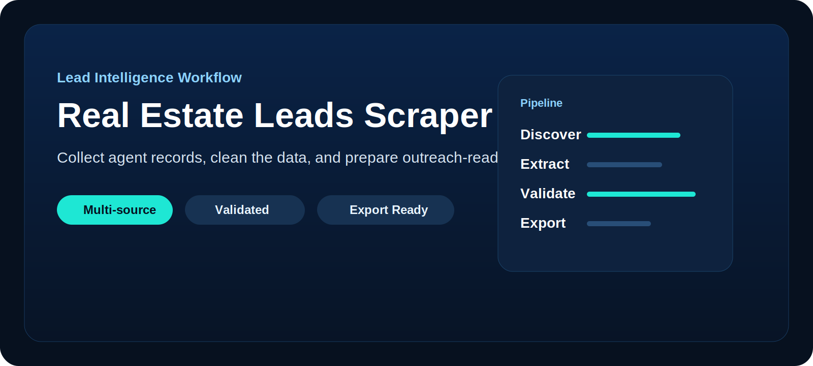
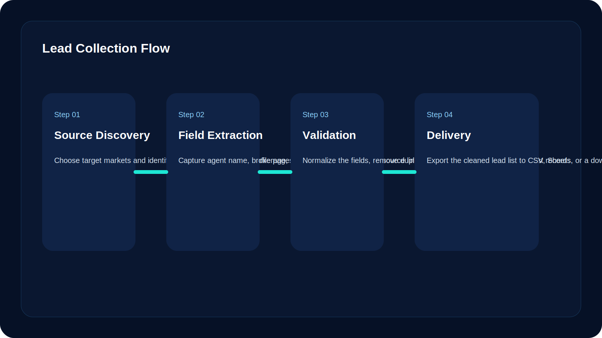
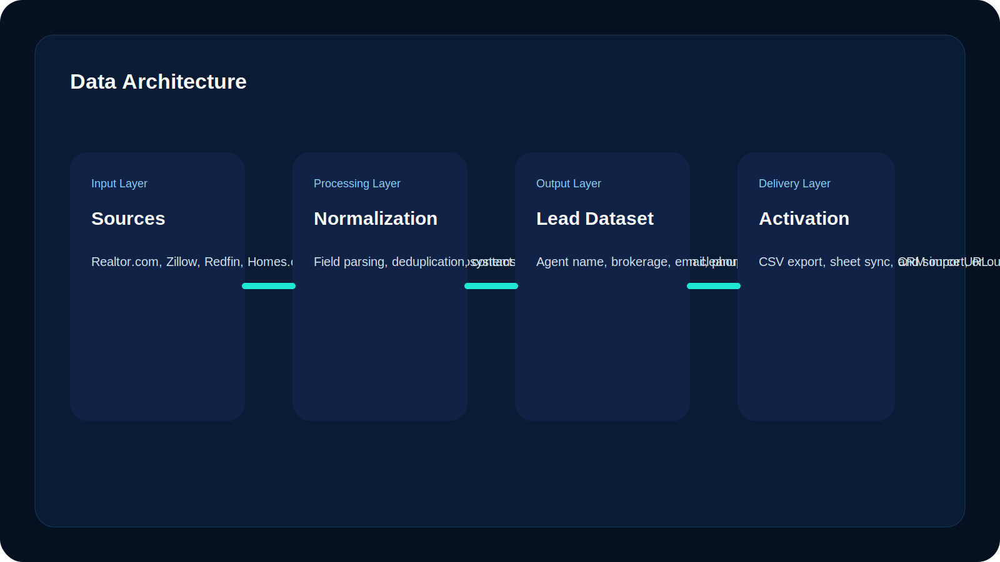
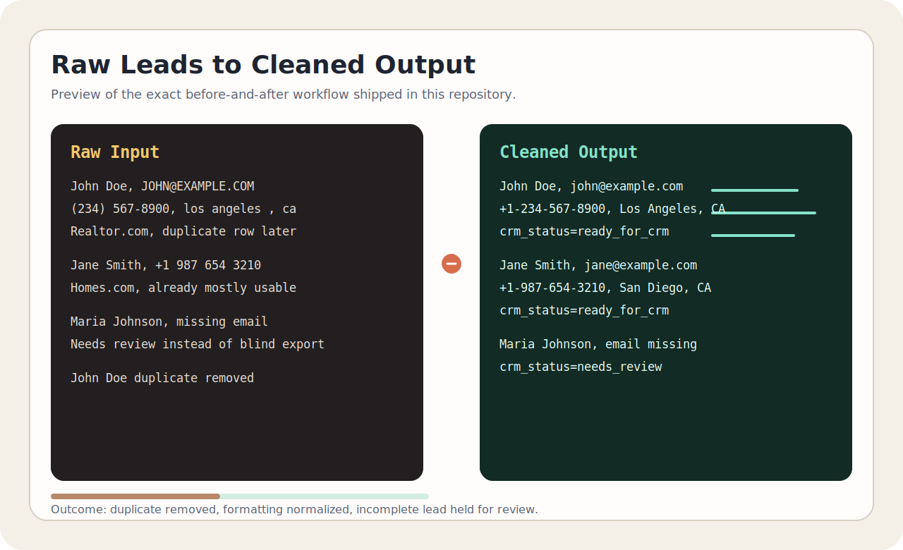
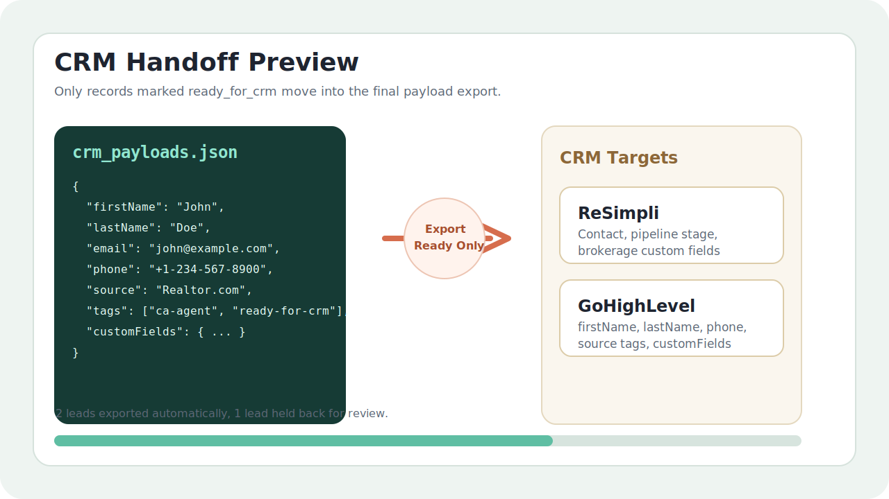

<p align="center">
  
</p>

# Real Estate Leads Scraper

A real-estate lead pipeline demo that turns messy agent records into CRM-ready leads for outreach teams.

This repository demonstrates the architecture, sample data flow, cleaning logic, deduplication rules, and CRM export shape of a real-estate agent lead pipeline that can be adapted for Homes.com/Realtor.com source or API data and handed off to ReSimpli or GoHighLevel.

## Executive summary

- Problem: outreach teams waste time manually collecting and cleaning agent data.
- Solution: standardize raw lead records, remove duplicates, flag weak records, and export only CRM-ready payloads.
- Proof included: raw sample input, cleaned CSV output, CRM payload JSON, field mapping, and runnable Python scripts.
- CRM target: ReSimpli or GoHighLevel style handoff.

## What problem this solves

Acquisition and outreach teams often need fresh lists of active real-estate agents in specific markets. The manual process is usually slow:

- search agent profiles one site at a time
- copy names, brokerages, phones, and emails into spreadsheets
- merge duplicate records by hand
- clean formatting before importing into a CRM
- lose time reviewing bad or incomplete lead records

This project turns that into a structured workflow: source lead data, normalize it, flag weak records, and produce CRM-ready output.

## Why this repo is strong

This repo now demonstrates the exact workflow Scott described instead of just talking about it:

- real-estate agent records
- name, email, phone, city, state, source, and URL fields
- Realtor.com and Homes.com compatible source structure
- duplicate detection and normalization
- review gating for incomplete leads
- CRM-ready payload mapping
- ReSimpli and GoHighLevel handoff examples

## Architecture





## Proof of workflow

### Before and after preview



### CRM export preview



These visuals mirror the real files included in this repo:

- [`examples/raw_leads_sample.csv`](examples/raw_leads_sample.csv)
- [`examples/sample_output.csv`](examples/sample_output.csv)
- [`examples/crm_payload_example.json`](examples/crm_payload_example.json)
- [`examples/webhook_mapping.md`](examples/webhook_mapping.md)
- [`artifacts/cleaned_leads.csv`](artifacts/cleaned_leads.csv)
- [`artifacts/crm_payloads.json`](artifacts/crm_payloads.json)

## What is included

### Example data

- [`examples/raw_leads_sample.csv`](examples/raw_leads_sample.csv): intentionally messy source-style records
- [`examples/sample_output.csv`](examples/sample_output.csv): cleaned and deduplicated output
- [`examples/crm_payload_example.json`](examples/crm_payload_example.json): example CRM-ready payload
- [`examples/webhook_mapping.md`](examples/webhook_mapping.md): field mapping for ReSimpli and GoHighLevel

### Utility scripts

- [`src/clean_leads.py`](src/clean_leads.py): normalizes, validates, and deduplicates sample lead records
- [`src/export_crm_payload.py`](src/export_crm_payload.py): converts cleaned leads into CRM payloads for downstream systems

## End-to-end demo flow

1. Start with raw records from a listing platform export or API response.
2. Normalize names, emails, phone numbers, cities, and states.
3. Remove duplicate records.
4. Mark each lead as `ready_for_crm` or `needs_review`.
5. Export CRM payloads only for records that are ready to post.

That is the exact operational shape of a production lead pipeline, even though this public repo intentionally uses safe sample data.

## Run the demo

```bash
python src/clean_leads.py
python src/export_crm_payload.py
```

The scripts read from `examples/` and write generated artifacts to `artifacts/`:

- `artifacts/cleaned_leads.csv`
- `artifacts/crm_payloads.json`

## Sample raw input

```csv
agent_name,brokerage,email,mobile_phone,city,state,source_platform,source_url
 John   Doe ,ABC Realty,JOHN@EXAMPLE.COM,(234) 567-8900, los angeles ,ca,Realtor.com,https://www.realtor.com/profile/johndoe
Jane Smith,XYZ Real Estate,jane@example.com,+1 987 654 3210,San Diego,CA,Homes.com,https://www.homes.com/real-estate-agents/janesmith
Maria Johnson,Midwest Property Group,,312.555.7812,Chicago,il,Realtor.com,https://www.realtor.com/profile/mariajohnson
John Doe,ABC Realty,john@example.com,2345678900,Los Angeles,CA,Realtor.com,https://www.realtor.com/profile/johndoe
```

## Sample cleaned output

```csv
agent_name,brokerage,email,mobile_phone,city,state,source_platform,source_url,crm_status
John Doe,ABC Realty,john@example.com,+1-234-567-8900,Los Angeles,CA,Realtor.com,https://www.realtor.com/profile/johndoe,ready_for_crm
Jane Smith,XYZ Real Estate,jane@example.com,+1-987-654-3210,San Diego,CA,Homes.com,https://www.homes.com/real-estate-agents/janesmith,ready_for_crm
Maria Johnson,Midwest Property Group,,+1-312-555-7812,Chicago,IL,Realtor.com,https://www.realtor.com/profile/mariajohnson,needs_review
```

## CRM-ready payload example

```json
{
  "firstName": "John",
  "lastName": "Doe",
  "email": "john@example.com",
  "phone": "+1-234-567-8900",
  "city": "Los Angeles",
  "state": "CA",
  "source": "Realtor.com",
  "tags": ["ca-agent", "off-market-outreach", "ready-for-crm"],
  "customFields": {
    "brokerage": "ABC Realty",
    "source_url": "https://www.realtor.com/profile/johndoe",
    "crm_status": "ready_for_crm"
  }
}
```

## Industrial positioning

This repo is strongest as a portfolio-grade pipeline demo, but it is framed the right way for real implementation work:

- source connectors can be swapped for Realtor.com or Homes.com APIs
- validation logic can be expanded for email and phone verification
- exports can be posted into ReSimpli or GoHighLevel webhooks
- logging, retry logic, and monitoring can be layered on top

That makes this repo useful in two ways:

- as a proof-of-understanding for a lead generation workflow
- as a starting point for a production lead-intelligence pipeline

## How to present it to a client

The strongest honest positioning is:

> This repository demonstrates the workflow, data model, cleaning logic, deduplication, and CRM-ready export shape for a real-estate agent lead pipeline. The production version would connect to source APIs first, then push validated records into ReSimpli or GoHighLevel.

## Summary

This project shows a real and understandable business workflow: take messy real-estate lead records, clean them, deduplicate them, and prepare them for CRM import or outreach automation.
